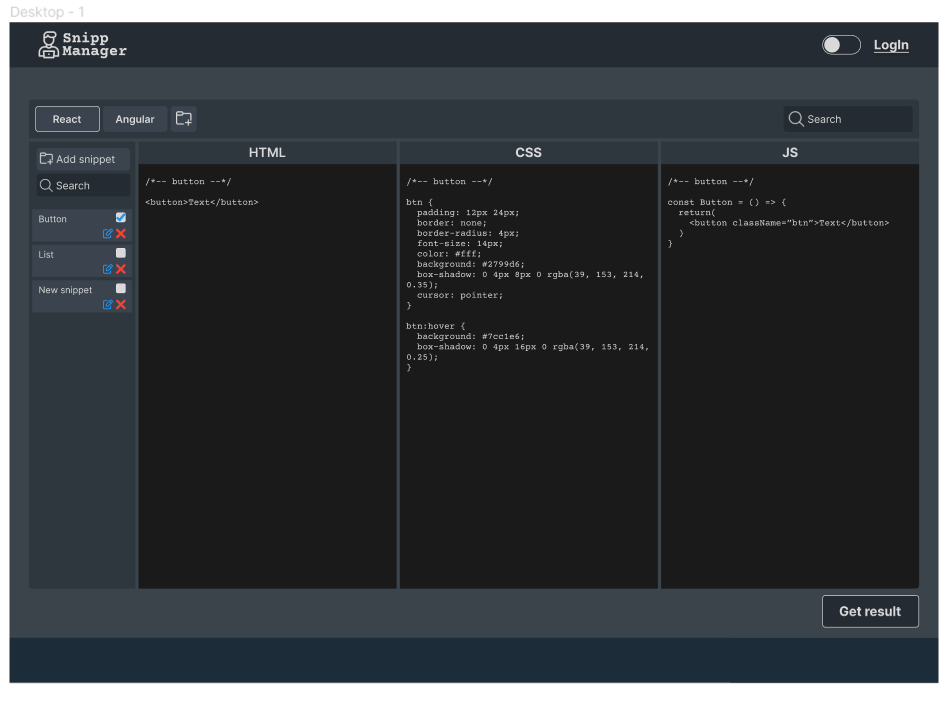
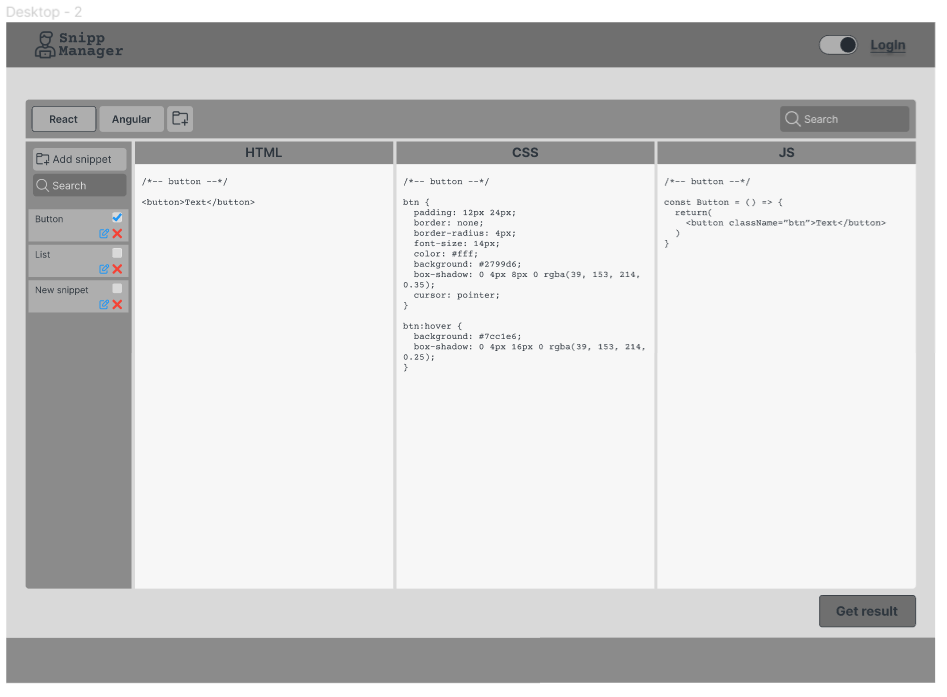

# Code snippets manager

### Header

- Кнопка переключения темы (светлая / темная)
- Кнопка регистрации / входа / иконка если вход выполнен (по ее нажатию всплывает модальное окно и дальнейшая регистрация / вход)

### Main

#### Collections (directories)

Условно набор из короторо будет создаваться (копироваться) итоговый файл + поиск по папкам
_Располагается горизонтально_

#### Snippets

В начале всех сниппетов кнопка add snippet + поиск по снипетам
Каждый сниппет это:
Чекбокс + название + кнопка редактировать + кнопка удалить

По нажатию на add snippet или кнопка редактировать открывается модальное окно в котором можно создать / изменить сниппет.

#### HTML, CSS, JS
Создать подстветку для кода

#### Кнопка Get result
Собирает три файла в папку и отдает пользователю

